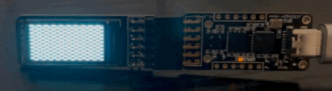

# iCE40lib : FPGA peripheral Library 

This repository contains various peripheral drivers written in Verilog for open-source ICE40 FPGAs.
iCESuger nano FPGA ships with several PMOD accessories. This repository contains Verilog IPs to work with them.


Content
======

1. [blinky](/blinky/) : LED blink example
2. [lcd](/lcd/) : Examples for PMOD 0.96in LCD
2. [st7735](/st7736/) : Driver for PMOD 0.96in LCD


LCD driver is configured for ICESugar nano default clock rate of 12MHz and this driver can save your SPI pins for SPI stuff.
<p align="center">
  
<br> Checkered demo on 0.96 oled
</p>


Build
Yosys toolchain is required to build the binary files.
For this, you can use the following docker container with all the dependencies

<p align="center">
  
</p>

<!-- [](https://hub.docker.com/r/archfx/ice40tools) -->

<!-- [](https://hub.docker.com/r/archfx/yosystools) -->

Follow the steps to build using the docker environment. (You should have the docker daemon installed on your system)

1. Clone the repository

```shell
git clone https://github.com/Archfx/ice40lib
```

2. Pull the docker image from docker-hub


```shell
docker pull archfx/ice40tools
```

3. Set the expected location to mount with the container
```shell
export LOC=/ice40lib
```

4. Run the Docker image
```shell
docker run -t -p 6080:6080 -v "${PWD}/:/$LOC" -w /$LOC --name ice40tools archfx/ice40tools
```
This will open up a browser window with 

5. Connect to the docker image

```shell
docker exec -it ice40tools /bin/bash
```

6. Compile the design and upload

Note change the --pl1k parameter with the chip model that you have. iCESugar Nano uses ice40LP1k-CM36 chip

```shell
cd ice40/examples/blinky

yosys -p 'synth_ice40 -top blinky -json blinky.json' blinky.v               # synthesize into blinky.json

nextpnr-ice40 --lp1k --json blinky.json --pcf blinky.pcf --asc blinky.asc --package cm36  # run place and route
icepack blinky.asc blinky.bin                                               # generate binary bitstream file

iceprog blinky.bin                                                       
```


Relevant Docs
=========

[IceSugar Nano Schematic](https://github.com/wuxx/icesugar-nano/blob/main/schematic/ICESugar-nano-v1.2.pdf)
[ulx3s](https://github.com/lawrie/ulx3s_examples)
[Some Drivers](https://github.com/damdoy/fpga_peripherals)

