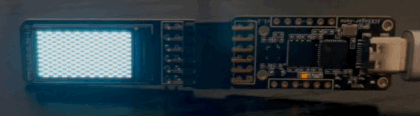

LCD IP
======

This folder contains two demo examples
1. checkered lcd demo
2. hex lcd demo

Run below commands inside the docker container

### Building checkered demo

<p align="center">
  
<br> lcd checkered demo on 0.96 oled
</p>

```shell
yosys -p 'synth_ice40 -top top_checkered -json checkered.json' top_checkered.v st7735.v

nextpnr-ice40 --lp1k --json checkered.json --pcf lcd.pcf --asc checkered.asc --package cm36

icepack checkered.asc checkered.bin
```
or simply run the bash script `compile_check.sh` from inside the docker environment


### Building hex demo

```shell
yosys -p 'synth_ice40 -top top_hex_demo -json hex.json' top_hex_demo.v oled_video.v hex_decoder.v

nextpnr-ice40 --lp1k --json hex.json --pcf lcd.pcf --asc hex.asc --package cm36

icepack hex.asc hex.bin
```